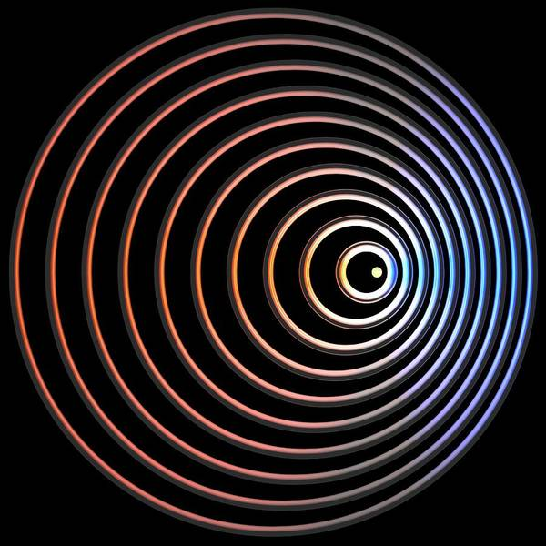
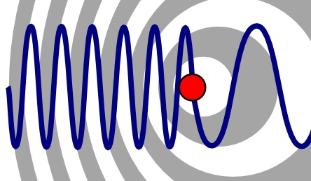

# Demontrating the Doppler Effect
This Arduino project simulates the Doppler effect, a phenomenon where the frequency of a sound or light source appears to change as an observer moves relative to the source. In this simulation, we use a simple LED connected to an Arduino to represent the change in light intensity that might be observed when an object is approaching or moving away.

## What is the Doppler Effect?
The Doppler effect, named after Austrian physicist Christian Doppler, is the change in frequency or wavelength of a wave as observed by an observer moving relative to the source of the wave. When an object emitting waves, such as sound or light, approaches an observer, the observer perceives an increase in frequency and a higher pitch or a shift towards the blue end of the spectrum (blueshift in light). Conversely, when the object moves away from the observer, the frequency decreases, resulting in a lower pitch or a shift towards the red end of the spectrum (redshift in light).

## How Does this Arduino Project Demonstrate the Doppler Effect?
This Arduino project offers a simplified visualization of the Doppler effect using an LED. The LED's brightness is adjusted to simulate the behavior of light from an object moving closer and farther away. As the LED appears to get brighter and dimmer, it provides a visual representation of the Doppler effect. Please note that this is a basic representation and does not account for frequency shifts that occur in actual Doppler effect phenomena.

Feel free to experiment with the code and circuit to understand the concept better and use it for educational purposes or as a starting point for more complex simulations.